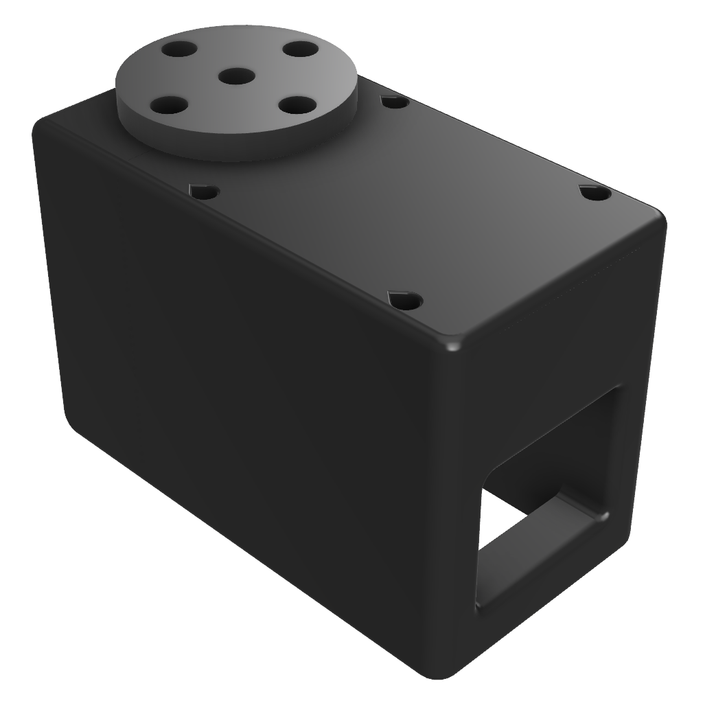

<!-- @format -->

# Servoless-leader-arm

<a href="https://youtu.be/yRe2bAQGQWk">
  
</a>

## A. Introduction

Instead of using Feetech servo motors on the Leader Arm, we’ve designed a 3D‐printable casing that houses an AS5600 magnetic‐encoder to act as a “dummy servo.” By mounting the AS5600 in a housing that has the same mounting dimensions as the Feetech motor, each joint on the Leader Arm uses a miniature Hall-effect sensor to measure absolute angular position with 12-bit precision. The advantages include:

- **Cost Savings:** AS5600 boards + magnets cost a fraction of a servo motor.
- **Compactness:** The casing mimics the footprint of the Feetech servo, so no change in mechanical linkage or link lengths.
- **Precision** Each joint has a 12 bit resolution, thus giving same amount of precision as a feetch servo.
- **Back‐drivability:** Since there is no gearbox, the joint is freely back‐drivable if pushed by an external force.

Each Leader Arm joint (6 total joints) will get its own AS5600 “servo casing,” wired back to a central I²C multiplexer + micro-controller.

<p align="center">
  
  
</p>

## B. Prechecks

### Tools Required

- Screwdriver _(PH1 and PH2 Bits needed)_
- Soldering Iron and Wire
- Flush Cutter

### Printing The Parts

A variety of 3D printers can be used to print the necessary parts for the arm. Follow these steps for optimal printing results.

#### 1. Select A Printer

When choosing a printer, keep the following recommended specifications in mind. While other printers may work, these specifications are a good starting point:

- **Layer Height:** Minimum 0.2mm
- **Material:** PLA+, ABS, PETG, or other durable plastics
- **Nozzle Diameter:** Maximum 0.4mm
- **Infill Density:** Approximately 30%
- **Suggested Printers:** Prusa Mini+, Bambu P1, Ender3, and similar models

#### 2. Prepare The Printer

- **Materials Needed:**

  - Standard Glue Stick
  - Putty Knife

- **Setup and Printing Process:**
  1. Calibrate the printer and level the print bed following your printer’s specific instructions.
  2. Clean the print bed, removing any dust or grease. If you use water or other cleaning agents, ensure the bed is fully dry.
  3. Apply a thin, even layer of glue to the print area. Avoid uneven application or clumps.
  4. Load the printer filament according to the printer's guidelines.
  5. Adjust the printer settings to match the recommended specifications listed above.
  6. Verify the file format, select files from the hardware folder, and begin printing.

### B. Printing and Parts

The servo-less leader features two designs for the servo casing [servo 1](CAD/STL/as5600_servo_1.stl) and [servo 2](CAD/STL/as5600_servo_2.stl)

<table>
  <tr>
    <td align="center">
      <br/>
      <b>Servo 1</b>
    </td>
    <td align="center">
      <br/>
      <b>Servo 2</b>
    </td>
  </tr>
  <tr>
    <td align="center">
      <br/>
      <b>Servo 1 Cross Section</b>
    </td>
    <td align="center">
      <br/>
      <b>Servo 2 Cross Section</b>
    </td>
  </tr>
</table>

Servo 1 is used in joints 1 through 4 and servo 2 for joints 5 and 6

| Item Name                                   | Quantity Per Arm | Unit Cost (incl GST) | Buy (India)                                                                                                                                                                                                                                                                                                                                                                                                                                                                                                                                                               |
| ------------------------------------------- | ---------------- | -------------------- | ------------------------------------------------------------------------------------------------------------------------------------------------------------------------------------------------------------------------------------------------------------------------------------------------------------------------------------------------------------------------------------------------------------------------------------------------------------------------------------------------------------------------------------------------------------------------- |
| Wemos D1 mini v2                            | 1                | ₹182.00              | [Robu.in](https://robu.in/product/d1-mini-v2-nodemcu-4m-bytes-lua-wifi-internet-of-things-development-board-based-esp8266/?gad_source=1&gad_campaignid=21296336107&gclid=Cj0KCQjw0qTCBhCmARIsAAj8C4YbD580afd7JTV_2vWp4SIUCKdXW59jYu-Wk0YEZ4AWOdSpvBoFxyAaAvbREALw_wcB)                                                                                                                                                                                                                                                                                                    |
| TCA9548A I2C Mux                            | 1                | ₹81.21               | [Zbotic](https://zbotic.in/product/cjmcu-tca9548a-i2c-8-channel-multiple-extensions-development-board/?gad_source=1&gclid=Cj0KCQjw2N2_BhCAARIsAK4pEkWZaUEnn1AonuzN7zrrJuBwX3K-bko7J3kNjnqQfr_lUvTFPkCQnpgaAuj4EALw_wcB)                                                                                                                                                                                                                                                                                                                                                   |
| AS5600 Encoder                              | 6                | ₹130.80              | [Quartz Components](https://quartzcomponents.com/products/as5600-magnetic-angle-encoder-sensor-module?variant=44904504492266)                                                                                                                                                                                                                                                                                                                                                                                                                                             |
| M3 x 6 philips head bolts                   | 48               | ₹3.00                | [Only Screws](https://onlyscrews.in/products/hex-allen-socket-head-m3-x-6-screw-pack-of-20?srsltid=AfmBOor482XuHLUrpOdCDrG-Go1E4GZqYg0EmdTY6sNbX8fbGjGZCeez)                                                                                                                                                                                                                                                                                                                                                                                                              |
| M2.2 x 9.5 philips head self tapping screws | 3                | ₹47.20               | [Robotics DNA](https://roboticsdna.in/product/2-2mm-dia-9-5mm-ss-self-tapping-screw-25-pieces/?src=google&kwd=&adgroup={adgroup}&device=c&campaign={campaign}&adgroup={adgroup}&keyword=&matchtype=&gad_source=1&gad_campaignid=22411741198&gclid=Cj0KCQjw0qTCBhCmARIsAAj8C4YcSURfn4xIPfqC6ZU851A3e9wjm49ESc_jJkYKZkwkTw2ZjKHKA_AaAkHNEALw_wcB)                                                                                                                                                                                                                           |
| Micro USB B cable 1 metre                   | 1                | ₹35.00               | [Robocraze](https://robocraze.com/products/usb-to-micro-usb-cable?variant=40192442007705&country=IN¤cy=INR&utm_medium=product_sync&utm_source=google&utm_content=sag_organic&utm_campaign=sag_organic&utm_source=google&utm_medium=cpc&utm_campaign=BL+%7C+Pmax+%7C+Feed+Only+%7C+Top+40+Revenue+%7C+09%2F06&utm_source=googleads&utm_medium=ppc&utm_campaign=21373062889&utm_content=_&utm_term=&campaignid=21373062889&adgroupid=&campaign=21373062889&gad_source=1&gclid=Cj0KCQjw2N2_BhCAARIsAK4pEkVDPtNGpsZV-ffHMIzdULpzGFAPsKl39PljBhO8jgnAKcCk_V_ssa4aAiHVEALw_wcB) |
| 2 Inch metal C clamp                        | 1                | ₹269.00              | [Amazon.in](https://www.amazon.in/Eastman-E-2036-C-CLAMP-INCH-2036/dp/B09F9F1KTF?th=1)                                                                                                                                                                                                                                                                                                                                                                                                                                                                                    |
| 30 AWG wire 1m                              | 5                | ₹5.00                | [Robu.in](https://robu.in/product/high-quality-ultra-flexible-30awg-silicone-wire-1000-m-white/?gad_source=1&gclid=Cj0KCQjwqv2_BhC0ARIsAFb5Ac9y5QrmGJUhl2DLI0UtK0kKlJsocsbkqFMvQ10A4MQIIVxtX2W-G8MaApTbEALw_wcB)                                                                                                                                                                                                                                                                                                                                                          |
| Perf Board                                  | 1                | ₹142.00              | [Robu.in](https://robu.in/product/12-x-18-cm-universal-pcb-prototype-board-single-sided-2-54mm-hole-pitch/)                                                                                                                                                                                                                                                                                                                                                                                                                                                               |
| Total                                       | ---              | ₹1,651               | ---                                                                                                                                                                                                                                                                                                                                                                                                                                                                                                                                                                       |

<p align="center">
  
</p>

### C. Assembly and Integration

For detailed Assembly and Integration steps, refer to the [OpenBot Giraffe Leader Arm Documentation](https://docs.openbot.co.in/docs/Giraffe/Assembly/Servo-Less%20Leader/leader_overview).

### D. Calibration Check (Optional)

You can perform a basic calibration check to confirm everything is working properly:

#### **1. Start the Script**

When running the script for the first time, it will automatically generate the required calibration and port data files:

```bash
python3 AS5600_reader.py
```

#### **1. Serial-Port Detection**

- You will be prompted to **unplug** the Leader Arm USB cable and press Enter
- Then, **replug** the cable and press Enter again
- The detected port is saved to:  
  `leader_port.txt`

#### **2. Calibration Routine**

- You will need to move the Leader Arm to these positions sequentially:

<table>
  <tr>
    <td align="center">
      <br/>
      <b>Zero Position</b>
    </td>
    <td align="center">
      <br/>
      <b>Rotated Position</b>
    </td>
  </tr>
</table>

- Once the arm is moved to the required positions, press Enter as instructed
- After completing both positions, the follower calibration is saved to:  
  `Calibration_Data.txt`

#### **3. Real-Time Angle Output**

- The script reads raw AS5600 sensor data over serial, converts it to degrees, applies a median filter for noise reduction, and continuously prints a six-element array of angles to the terminal.

Press **Ctrl + C** to exit the script.

> **Note:**  
> You can also import the `AS5600Sensor` class to access sensor data within any Python file for custom applications.
